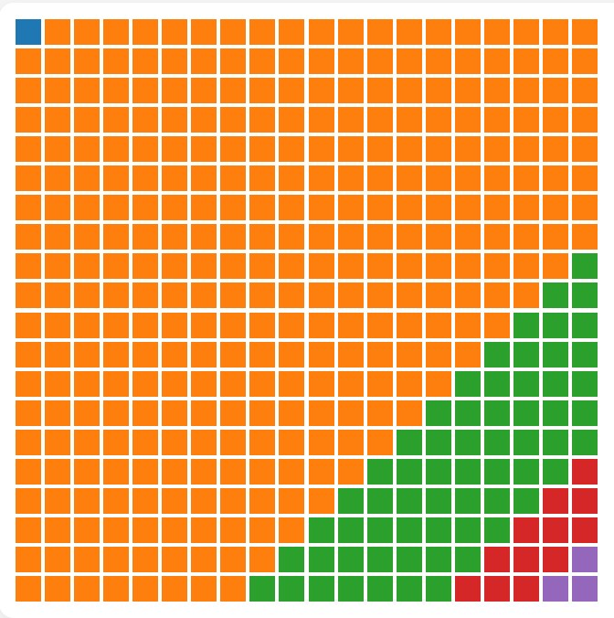
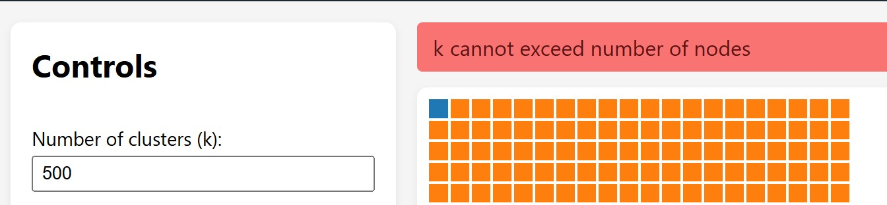
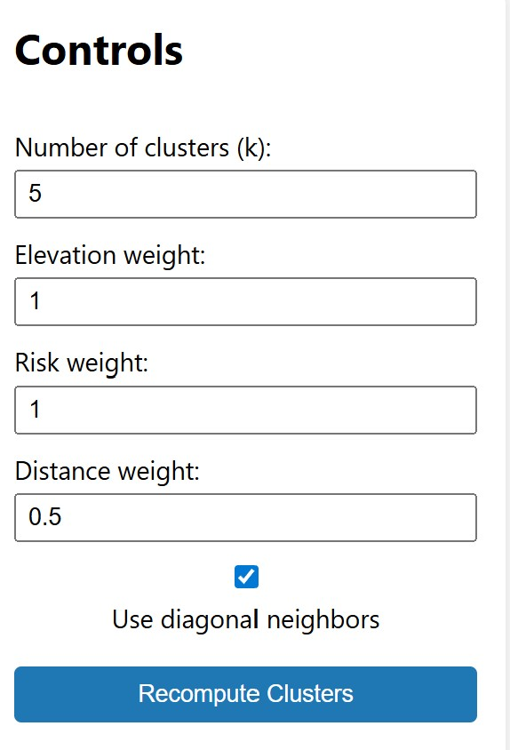
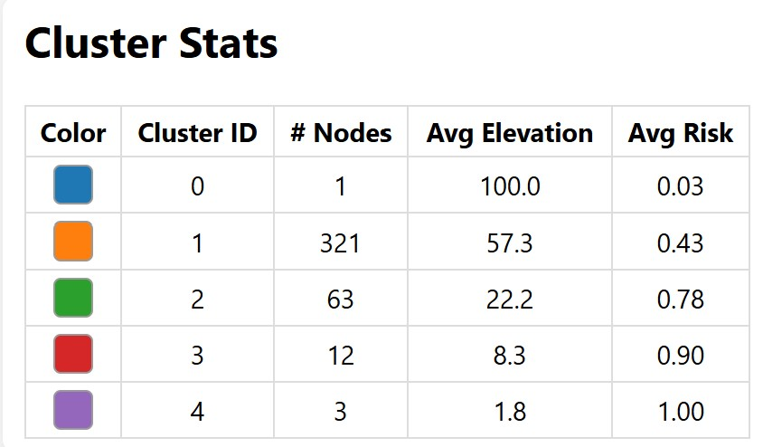

# FloodClusterMST

**Authors:** Mostafa Tarek & Faahil Ali  
**Course:** CMPSC 463 — Project 2

## Description of Project

FloodClusterMST is an interactive web application that models flood risk clustering on a synthetic 20×20 grid. Each cell on the grid represents a location with its own elevation, risk score, and position. The backend builds a weighted graph from these locations and uses Kruskal’s Minimum Spanning Tree algorithm to connect them in the most cost efficient way. By removing the largest edges in the MST, the system separates the grid into clusters that reflect similarities in terrain and flood risk.

The goal of the project is to take ideas from algorithmic design and apply them to a weather related scenario. Users can adjust settings such as elevation weight, risk weight, distance weight, and the number of clusters to observe how these choices affect the final grouping of the grid.

## Significance

Flooding is one of the most frequent and damaging weather events, and understanding how areas group together in terms of elevation and risk can help with planning and response. Even though the system uses synthetic data, the structure of the application resembles how real agencies might study terrain and identify regions that could be more vulnerable during severe weather.

This project is meaningful because it shows how classical algorithms can be applied to practical situations. By adjusting different weights, users can see how terrain, risk levels, and spatial layout influence the shape of the clusters. The visual interface also makes it easier to recognize how different parameters change the interpretation of the region.

Overall, the project connects theoretical algorithms to an environmental problem in a way that is both educational and useful.

## Code Structure
``` python
FloodClusterMST/
│
├── floodclustermst_backend/
│   ├── algorithms/
│   │   ├── __init__.py
│   │   ├── clustering.py
│   │   ├── data_loader.py
│   │   ├── disjoint_set.py
│   │   ├── graph_builder.py
│   │   └── kruskal.py
│   │
│   ├── app.py
│   ├── config.py
│   └── requirements.txt
│
├── floodclustermst-frontend/
│   ├── node_modules/
│   ├── public/
│   ├── src/
│   │   ├── App.css
│   │   ├── App.js
│   │   ├── api.js
│   │   ├── index.js
│   │   └── components/
│   │       ├── GridView.js
│   │       ├── Controls.js
│   │       └── ClusterStats.js
│   ├── package-lock.json
│   └── package.json
│
└── Report.md
```

The backend and frontend each handle different parts of the project, but they work together to make the system function smoothly. The backend is where all the computational work happens. It creates the 20×20 grid, calculates each location’s attributes, and builds the graph by connecting neighboring cells. All of the algorithms (Kruskal’s MST, Union Find, graph building, and clustering) are stored inside the algorithms folder. Once the MST is built and split into k clusters, the backend sends the cluster labels, colors, and statistics to the frontend through the API routes in app.py.

The frontend focuses completely on visualization and user interaction. It displays the grid and colors each cell based on its assigned cluster. The interface lets users adjust weights, choose the number of clusters, and toggle diagonal neighbors. When the user clicks recompute, the frontend sends those settings to the backend and updates the grid with the new result. It also shows a clean table with cluster statistics and a color preview for each cluster, which makes it easy to understand what the algorithm produced.

Overall, the backend handles the logic and the frontend turns it into something you can clearly see and experiment with.

## Algorithm Descriptions 

### Union Find (Disjoint Set)

Union Find is the data structure that prevents cycles during MST construction. It does this by keeping track of which nodes belong to the same connected component. The `find` function uses path compression, and `union` uses a rank comparison so the trees stay shallow and fast.

```python
def find(x):
    if parent[x] != x:
        parent[x] = find(parent[x])
    return parent[x]

def union(a, b):
    rootA = find(a)
    rootB = find(b)
    if rootA == rootB:
        return False
    if rank[rootA] < rank[rootB]:
        parent[rootA] = rootB
    else:
        parent[rootB] = rootA
        if rank[rootA] == rank[rootB]:
            rank[rootA] += 1
    return True
```

This structure allows Kruskal’s algorithm to run efficiently even on hundreds of edges.

### Edge Weight Function

Each edge in the grid graph is assigned a weight based on how different two neighboring cells are. The formula combines three components: elevation difference, flood risk difference, and the Euclidean distance between the cells on the grid. The user controls how important each factor is through the weights set in the frontend.

```python
weight = (
    elevation_weight * abs(u["elevation"] - v["elevation"])
    + risk_weight * abs(u["risk_score"] - v["risk_score"])
    + distance_weight * math.sqrt((u["x"] - v["x"])**2 + (u["y"] - v["y"])**2)
)
```

In simpler terms, the MST prefers connecting cells that are similar in elevation or risk when those sliders are increased, while the distance term discourages long spatial jumps. This lets the user shape how the clusters form by adjusting which environmental features the algorithm cares about most.

### Kruskal’s MST

Kruskal’s algorithm builds the MST by considering edges from lightest to heaviest. Each time an edge connects two components that are not already joined, the algorithm adds it to the MST. The implementation in this project uses the weighted edges produced by compute_edge_weight and the Union Find structure described above.

```python
edges.sort(key=lambda e: e.weight)
mst = []

for edge in edges:
    if union(edge.u, edge.v):
        mst.append(edge)
```

By the time all edges are processed, the MST contains exactly N − 1 edges, where N is the number of grid cells. This tree represents the most “consistent” way to connect the entire grid according to the chosen weights.

### Cutting the MST into Clusters

Once the MST is computed, creating clusters is simple. The idea is that the heaviest edges in the MST represent the largest “gaps” or natural divisions in the data.

Steps:

1) Build the full MST
2) Sort the MST edges by weight from smallest to largest
3) Remove the (k − 1) largest edges
4) The remaining connected components form the k clusters

This method is a common approach in MST based clustering and works well for geographic data.


## Verification of Algorithms

We tested the algorithms on a few small, controlled examples before applying them to the full 20×20 grid. These toy examples make it easier to see whether Kruskal’s algorithm, Union–Find, and the cluster splitting step are all working correctly.

### Toy Example A: Simple MST (No Weights)

To check that the MST and clustering steps were working correctly, we first tested a very small graph with four nodes. The setup is shown below:
```less
A ---1--- B
| \
4   3
|     \
C ---2--- D
```

Edges sorted by weight:

1) *AB = 1*
2) *CD = 2*
3) *AD = 3*
4) *AC = 4*

Constructing MST:
- Start with *AB*
- Add *CD*
- Add *AD*
- Skip *AC* because it forms a cycle

The resulting MST contains the edges *AB, CD, AD,* with a total weight of *6*.


If we want to split this graph into k = 2 clusters, we remove the largest MST edge, which is AD. This leaves two connected components:
- *{A, B} and {C, D}*

This validates that the core MST and cluster splitting logic are working as expected.


### Toy Example B: Weighted MST with Elevation, Risk, Distance

This example checks whether the weighted edge formula behaves correctly. Each node has an elevation value and a flood risk value:
| Node | Elevation | Risk |
| ---- | --------- | ---- |
| A    | 10        | 0.2  |
| B    | 11        | 0.3  |
| C    | 30        | 0.9  |
| D    | 31        | 1.0  |

Weights:
- elevation = 1
- risk = 2
- distance = 0 (ignored for simplicity)

Now we compute the edge weights:
Edge A–B:
- Elevation difference = 1  
- Risk difference = 0.1  
- Weight = 1 + 0.2 = 1.2  

Edge C–D:
- Elevation difference = 1  
- Risk difference = 0.1  
- Weight = 1.2  

Edge B–C:
- Elevation difference = 19  
- Risk difference = 0.6  
- Weight = 19 + 1.2 = 20.2  

From these calculations, A–B and C–D are clearly the lowest weight edges. The MST will connect those two pairs first. The next smallest connection depends on which remaining edge has the lowest weight.

This example shows that the weighted formula behaves properly. Nodes that are similar in elevation and risk are linked together first, and nodes that differ greatly receive much heavier edges. This matches the intended behavior of the clustering system.

## Functionalities of the System

The application provides an interactive way to explore how flood risk clusters form on a 20×20 grid. Every cell in the grid contains two values, elevation and risk. The frontend visualizes the entire grid by coloring each cell according to the cluster it belongs to. Users can control how the clusters are formed by adjusting several parameters, such as the number of clusters (k) and the weights for elevation, risk, and spatial distance. Once the user updates any of these values and recomputes, the system calculates the MST on the backend and immediately updates the visualization.

A key feature of the system is the option to enable or disable diagonal neighbors. Normally, each cell connects only to its four direct neighbors (up, down, left, right). When diagonal neighbors are enabled, each cell gains up to four extra connections, which makes the graph denser and gives the MST more options when selecting low weight edges. This usually creates smoother, more rounded clusters. When diagonals are disabled, clusters tend to form more blocky, grid aligned shapes. Even though it looks like a small toggle, it has a noticeable effect on how the MST grows and how the final clusters look.

After computing the clusters, the frontend also displays a table of statistics for each region. This includes the cluster’s color, the number of nodes inside it, and the average elevation and risk score. Seeing both the visual grid and the numerical summaries helps explain how the algorithm is grouping locations.

The system also checks for invalid inputs and displays clear error messages when something cannot be computed. All communication between the frontend and backend happens through simple REST API calls, which keeps the interface responsive while the heavier computations run on the backend.

## Time Complexity Analysis

The most expensive part of the system is the MST construction using Kruskal’s algorithm. The grid contains 400 nodes arranged in a 20×20 structure. Each node connects to either 4 or 8 neighbors depending on whether diagonal connections are enabled. In practice, this gives the graph a little under 3,000 total edges.

Kruskal’s algorithm first sorts all edges by weight, which takes **O(E log E)** time. Since the number of edges is much larger than the number of nodes, this step dominates the overall runtime. After the edges are sorted, the algorithm processes them one by one and uses Union Find to check whether adding an edge creates a cycle. These operations run in almost constant time because of path compression and union by rank. As a result, the total complexity of the MST step is still **O(E log E)**.

The clustering step is simple. Once the MST is built, the program sorts the MST edges again and removes the (k − 1) largest ones. Sorting the MST edges is **O(E log E)**, but since the MST only contains 399 edges, this is effectively negligible. After the split, each connected component is labeled with a BFS or DFS, which runs in **O(V + E)**. For a fixed grid of size 20×20, this work is very small.

The frontend operations, such as rendering the grid or updating cluster colors, run in the browser and take time proportional to the number of cells. This is **O(V)**, which is quick for 400 nodes.

Overall, the complete system is dominated by the sorting step in Kruskal’s algorithm. The total time complexity is: **O(E log E)**

## Space Complexity Analysis

The largest space requirement comes from storing the nodes and edges. The grid always contains 400 nodes, and the number of edges is a few thousand depending on diagonal settings. Each node stores elevation, risk, coordinates, and an ID. Each edge stores the IDs of the two nodes it connects and a numeric weight. This results in **O(V + E)** space.

The Union Find structure stores two arrays: one for parent links and one for ranks. Each array has size V, giving a total of **O(V)** space.

The MST itself stores exactly V − 1 edges, so it also uses **O(V)** space. The clusters are stored as a list of labels for each node, which again requires **O(V)**.

The frontend keeps its own copy of the node list, cluster labels, and statistics, all of which scale linearly with the number of cells. Rendering the grid does not require extra memory beyond what is already stored in React state.

Putting everything together, the space requirements grow with the number of nodes and edges in the grid. For the fixed 20×20 grid used in this project, the memory usage stays small. In general, the space complexity of the system is: **O(V + E)**

## Execution Results and Analysis

After completing both the backend and frontend, the system was tested using a variety of parameter settings to observe how the MST and clustering respond to different conditions. The goal was to analyze how elevation, flood risk, spatial distance, and the diagonal neighbor option influence the structure of the clusters on the 20×20 grid.

The weight settings had a clear impact on how the MST formed. When elevation weight was increased, the MST tended to connect cells with similar elevation, which produced clusters that followed gradual terrain changes across the grid. Increasing the risk weight created clusters that grouped together high risk or low risk areas, depending on the distribution of the synthetic data. When the distance weight was made larger, the MST strongly avoided long connections, which resulted in clusters that were tighter and more compact. These observations matched the expected behavior of the weight function in the backend.

Below is an example of the clustered grid under the default settings:

<p align="center">
  
</p>

Changing the number of clusters (k) also produced predictable results. Setting k to 1 generated a single large cluster covering the entire grid, since no edges were removed from the MST. Increasing k caused the algorithm to cut the MST at the (k − 1) heaviest edges, which split the grid into smaller and more distinct regions. When k was set to values that exceeded the number of nodes, the backend returned a clear error message. This confirmed that invalid inputs were handled safely and did not break the application.

Here is the error message that appears when k is too large:


<p align="center">
  
</p>


A separate set of tests focused on the diagonal neighbor option. With diagonal connections disabled, the graph was more grid aligned and clusters tended to have sharper, block like boundaries. When diagonal neighbors were enabled, each cell had more possible connections, which allowed the MST to find smoother paths. This produced clusters with more rounded or blended shapes. Even though this setting is simple, it consistently changed how the MST grew, making it easy to see how graph density influences the final clustering.

The interface below shows the parameters used for recomputing clusters during testing:

<p align="center">
  
</p>


The frontend consistently displayed the correct cluster coloring and cluster statistics for every test. The color chips in the statistics table matched the colors drawn on the grid, which helped verify that the backend labels were being applied correctly. Recomputing clusters with new parameters updated both the grid and the statistics instantly, confirming that the interaction between frontend and backend worked reliably.

Cluster statistics example:

<p align="center">
  
</p>


Overall, the results aligned with the theoretical behavior of Kruskal’s MST and the clustering method used in this project. The visualization made it easy to understand how different parameters affected the grouping of locations, and the system remained responsive throughout the testing process.

## Conclusions

This project brought together graph algorithms, clustering techniques, and a real time interactive interface to explore how terrain and flood risk factors can influence regional grouping. By combining Kruskal’s MST with adjustable weights for elevation, risk, and spatial distance, the system was able to generate clusters that reacted in predictable but visually meaningful ways. The frontend made those patterns easy to understand, and testing showed that the backend and frontend communicated reliably under different parameter settings.

While the system works well for synthetic data, there is still room to grow. Future versions could incorporate real elevation and flood risk datasets, experiment with different distance metrics, or even replace the synthetic grid with a real map. It would also be interesting to compare MST based clustering with other approaches, such as k means or density based methods, to see how the results differ. Overall, the project successfully demonstrated how algorithmic tools can be applied to weather related risk analysis, and it provides a solid foundation for more advanced exploration.

## Video Demonstration
Link: 
